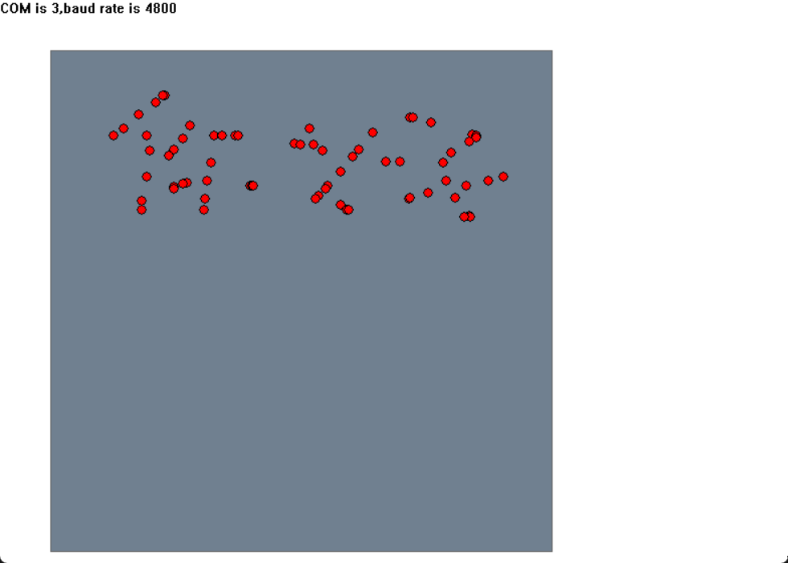

# C-Paint

基于C语言的绘画工具，可以将位置由串口发送，目前正在制作

## 已实现的功能

- [x] 按照固定时间间隔记录鼠标手势
- [x] 支持读取设备管理器中所有的端口(*程序未开放*)
- [x] 支持刷新端口列表(*程序未开放*)
- [x] 实现鼠标手势绘制记录 (*Version 0.2.0*)
- [x] 更灵活的页面(*Version 0.2.0*)

## 程序截图

| 手势录制 | 端口选择(程序未开放) |
|----------|----------|
| | |

## 程序指南

### 手势文件保存

手势文件的保存位置位于可执行文件同级目录的Data目录下，

文件名为开始绘制的时间戳。

## TODO

- [ ] 实现时间间隔可设置
- [ ] 串口发送功能

## 已知的问题

欢迎提交[ISSUE](https://github.com/iMoonway/C-Paint/issues)
